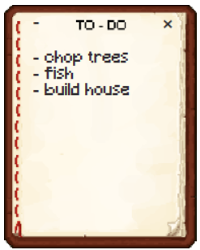
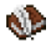

# Minecraft TO-DO

### Simple Qt widget to-do list designed to sit on top of games    
- Resizable, draggable   
- Minimizable (to a small icon that returns the list when clicked)   
- Content is stored between turning off and on again    
- Stylised for minecraft but can be used anywhere, also outside of games

## Roadmap
- A page that can be shared between users (collaborative notes)

## Gallery
- To-do list with example tasks     

- Minimized To-do list      

